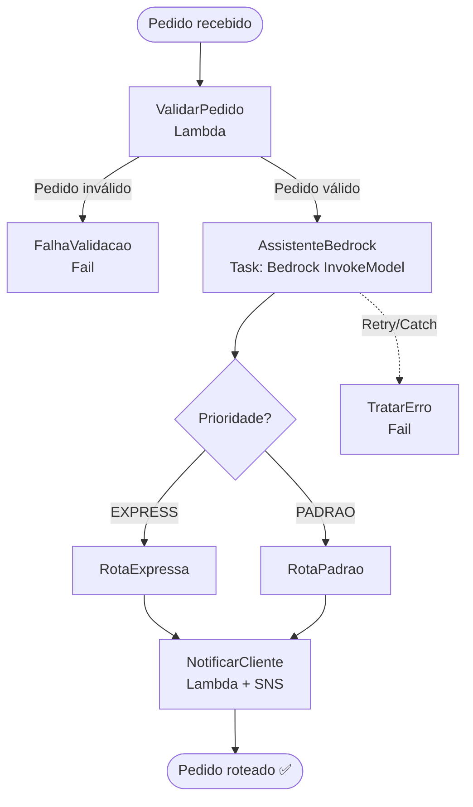

# 🛵 Assistente de Delivery Serverless — AWS Step Functions + Amazon Bedrock

> Projeto prático do bootcamp **AWS — Agentes de IA em Campo** (DIO).
> Orquestração *serverless* de um assistente de delivery que valida pedidos, gera respostas em linguagem natural com **Amazon Bedrock** e decide a rota de entrega usando **AWS Step Functions**.


---

## 📌 Situação-problema

Uma empresa de delivery recebe centenas de pedidos por hora. Cada pedido precisa ser
**validado**, **interpretado** (o cliente escreve em linguagem natural: *"quero uma pizza
grande, sem cebola, entrega rápida"*) e **roteado** para a fila de entrega correta —
tudo isso com baixa latência, alta disponibilidade e **sem gerenciar servidores**.

A solução combina:

- **AWS Step Functions** como orquestrador do fluxo (máquina de estados *Standard*).
- **AWS Lambda** para as tarefas atômicas (validar, notificar).
- **Amazon Bedrock** para gerar a resposta ao cliente e classificar a prioridade do pedido em linguagem natural.
- **Amazon SNS** para a notificação final.

---

## 🏗️ Arquitetura



**Fluxo da máquina de estados**

| # | Estado | Tipo | Função |
|---|--------|------|--------|
| 1 | `ValidarPedido` | `Task` (Lambda) | Valida itens, endereço e valor mínimo |
| 2 | `AssistenteBedrock` | `Task` (Bedrock) | Interpreta o pedido e sugere resposta + prioridade |
| 3 | `DecidirRota` | `Choice` | Direciona por `EXPRESS` ou `PADRAO` |
| 4 | `RotaExpressa` / `RotaPadrao` | `Pass` | Define SLA e taxa de entrega |
| 5 | `NotificarCliente` | `Task` (Lambda) | Publica confirmação no SNS |
| — | `TratarErro` | `Fail` | Captura falhas com `Retry` + `Catch` |

A definição completa está em [`statemachine/delivery-assistant.asl.json`](statemachine/delivery-assistant.asl.json).

---

## 🧰 Tecnologias

- **AWS Step Functions** (Amazon States Language — ASL)
- **AWS Lambda** (Python 3.12)
- **Amazon Bedrock** (modelo Anthropic Claude via `bedrock-runtime:InvokeModel`)
- **Amazon SNS** (notificações)
- **AWS SAM** (infraestrutura como código)
- **IAM** com princípio do menor privilégio

---

## ✅ Pré-requisitos

- Conta AWS com acesso ao **Amazon Bedrock** (modelo habilitado na região, ex.: `us-east-1`).
- **AWS CLI** e **AWS SAM CLI** instalados e configurados (`aws configure`).
- **Python 3.12**.
- Permissão de perfil (IAM) para Step Functions, Lambda, Bedrock e SNS.

> No lab da DIO isto corresponde às etapas *"Nível 1 — permissão de perfil"* e
> *"Nível 2 — disponibilidade de serviço"*.

---

## 🚀 Deploy

```bash
# 1. Clonar o repositório
git clone https://github.com/ftomaz5/assistente-de-delivery-serverless.git
cd assistente-de-delivery-serverless

# 2. Build da aplicação
sam build

# 3. Deploy guiado (cria a State Machine, Lambdas, SNS e roles)
sam deploy --guided
```

Ao final, o SAM exibe o **ARN da máquina de estados**. Inicie uma execução com o
payload de exemplo:

```bash
aws stepfunctions start-execution \
  --state-machine-arn <ARN_DA_STATE_MACHINE> \
  --input file://events/pedido-exemplo.json
```

---

## 🧪 Exemplo de entrada

```json
{
  "pedidoId": "PED-1042",
  "cliente": { "nome": "Flávio", "telefone": "+55 11 99999-0000" },
  "mensagem": "Quero uma pizza grande de calabresa sem cebola, entrega o mais rápido possível",
  "itens": [{ "nome": "Pizza grande calabresa", "quantidade": 1, "preco": 54.9 }],
  "endereco": "Av. Paulista, 1000 - São Paulo/SP",
  "valorTotal": 54.9
}
```

Saída esperada (resumida):

```json
{
  "status": "ROTEADO",
  "prioridade": "EXPRESS",
  "sla": "30 min",
  "respostaCliente": "Olá Flávio! Seu pedido de pizza grande de calabresa (sem cebola) foi confirmado e sairá em entrega expressa. 🍕",
  "canalNotificacao": "SNS"
}
```

---

## 💰 Precificação e custos

O modelo *serverless* é **pay-per-use**. Estimativa para uso de estudo/portfólio:

| Serviço | Métrica | Custo aproximado |
|---------|---------|------------------|
| Step Functions (Standard) | US$ 0,025 / 1.000 transições | Centavos por milhares de execuções |
| Lambda | 1M req/mês grátis (free tier) | ~US$ 0 |
| Bedrock (Claude) | por 1K tokens de entrada/saída | Poucos centavos por execução |
| SNS | 1M publicações/mês grátis | ~US$ 0 |

> Sempre destrua os recursos após os testes com `sam delete` para evitar custos.

---

## 📁 Estrutura do projeto

```
assistente-de-delivery-serverless/
├── README.md
├── template.yaml                     # Infra como código (AWS SAM)
├── statemachine/
│   └── delivery-assistant.asl.json   # Definição da máquina de estados (ASL)
├── src/
│   ├── validar_pedido/
│   │   └── lambda_function.py
│   └── notificar_cliente/
│       └── lambda_function.py
├── events/
│   └── pedido-exemplo.json           # Payload de teste
├── .gitignore
└── LICENSE
```

---

## 📚 O que este projeto demonstra

- Orquestração de microsserviços com **Step Functions** (estados `Task`, `Choice`, `Pass`, `Fail`).
- Tratamento de erros resiliente com **`Retry`** e **`Catch`**.
- Integração direta Step Functions → **Bedrock** (`arn:aws:states:::bedrock:invokeModel`).
- **IaC** reprodutível com AWS SAM.
- Boas práticas de **IAM de menor privilégio** e variáveis de ambiente.

---

## 👤 Autor

**Flávio Tomaz** — [github.com/ftomaz5](https://github.com/ftomaz5)
Projeto desenvolvido para o bootcamp *AWS — Agentes de IA em Campo* da [DIO](https://www.dio.me).

## 📄 Licença

Distribuído sob a licença **MIT**. Veja [`LICENSE`](LICENSE).
# assistente-de-delivery-serverless
Assistente de delivery serverless com AWS Step Functons e Amazon Bedrock (bootcamp AWS - Agentes de IA e Campo, DIO).
